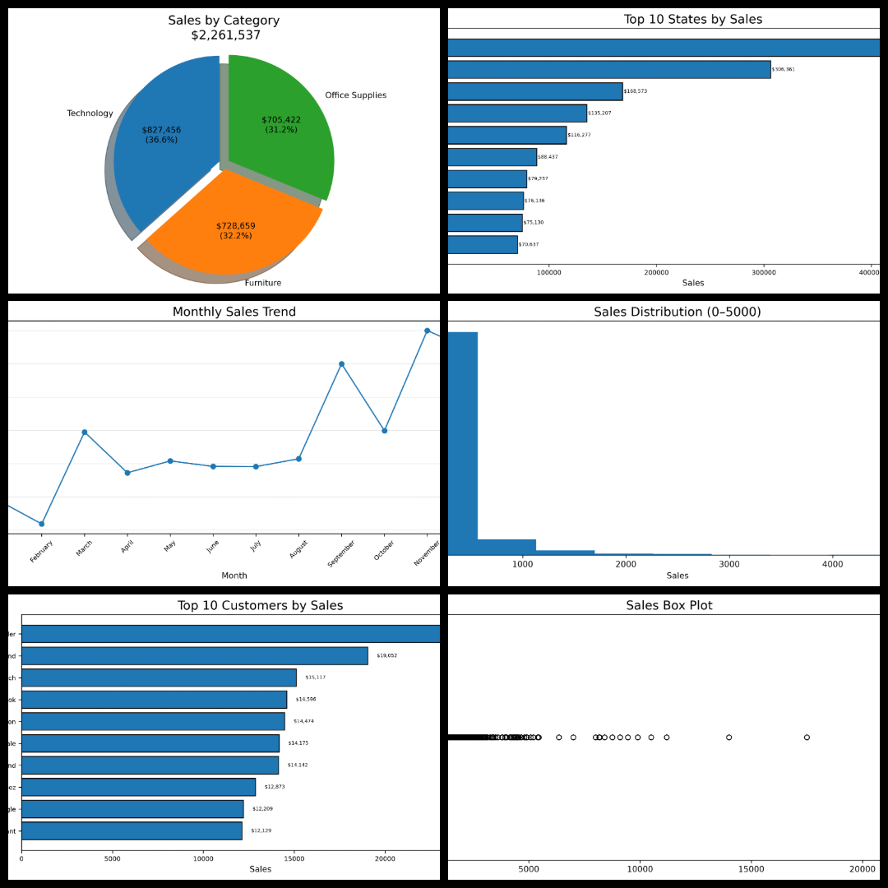

# 🛒 Superstore Sales Data Analysis | Python - Pandas - Matplotlib

## 📌 Project Overview

This project analyzes a Superstore Sales dataset to uncover valuable business insights using **Python, Pandas, and Matplotlib**. The analysis focuses on sales performance across different categories, regions, customers, products, and time periods.

The goal of this project is to demonstrate the complete data analysis workflow—from data cleaning and feature engineering to exploratory data analysis (EDA) and visualization.

---

## 📸 Project Preview


> A snapshot of the key visualizations generated during the analysis.

---

## 📂 Dataset

- **Source:** Kaggle
- **Records:** 9,800
- **Features:** 18
- **Format:** CSV

### Dataset Columns

- Order ID
- Order Date
- Ship Date
- Ship Mode
- Customer Details
- Region, State, City
- Category & Sub-Category
- Product Name
- Sales

---

# 🛠️ Technologies Used

- Python
- Pandas
- Matplotlib

---

# 🧹 Data Cleaning

The following preprocessing steps were performed:

- Checked dataset shape
- Examined data types
- Checked missing values
- Identified duplicate records
- Analyzed column cardinality
- Converted date columns to datetime format

---

# ⚙️ Feature Engineering

New columns were created for deeper analysis:

- Order Year
- Order Month
- Month Number
- Quarter
- Weekday
- Weekday Number
- Shipping Days

---

# 📊 Exploratory Data Analysis (EDA)

The following business questions were answered:

## Sales Performance

- Sales by Category
- Sales by Sub-Category
- Sales by Region
- Top 10 States by Sales
- Top 10 Cities by Sales
- Sales by Customer Segment
- Sales by Shipping Mode

## Customer & Product Analysis

- Top 10 Customers by Sales
- Top 10 Customers by Number of Orders
- Top 10 Products by Sales
- Bottom 10 Products by Sales

## Time Series Analysis

- Monthly Sales Trend
- Monthly Orders Trend
- Yearly Sales Trend
- Quarterly Sales Trend
- Sales by Weekday

## Additional Analysis

- Average Sales by Category
- Number of Orders by Category
- Average Shipping Days
- Sales Distribution (Histogram)
- Sales Outlier Detection (Box Plot)

---

# 📈 Key Business Insights

### 📦 Product Performance

- Technology generated the highest sales among all product categories.
- A few products contributed significantly to overall sales, while several products generated comparatively low revenue.

### 🌍 Regional Performance

- California recorded the highest sales among all states.
- New York ranked as the second-highest revenue-generating state.
- The West region contributed the largest share of total sales.

### 👥 Customer Insights

- A small group of customers generated a significant portion of total sales.
- Customers with the highest revenue were not always the customers with the highest number of orders.

### 📅 Sales Trends

- Sales showed noticeable seasonal variation throughout the year.
- Monthly sales and order volumes revealed fluctuations in customer purchasing behavior.
- Quarterly analysis highlighted periods of stronger business performance.

### 🚚 Shipping Analysis

- Standard Class was the most frequently used shipping mode.
- Average shipping time was approximately **4 days**.

### 📊 Sales Distribution

- Sales values were positively (right) skewed.
- Most transactions consisted of low-value orders, while a small number of high-value orders contributed significantly to total sales.
- Several high-value outliers were identified using a box plot.

---

# 📸 Visualizations

The project includes the following charts:

- Pie Charts
- Bar Charts
- Horizontal Bar Charts
- Line Charts
- Histogram
- Box Plot

All visualizations are saved automatically in the **images/** folder.

---

# ▶️ How to Run

1. Clone the repository

```bash
git clone https://github.com/Kainatsiddiqui/Superstore-Sales-Data-Analysis
```

2. Navigate to the project directory

```bash
cd Superstore-Sales-Data-Analysis
```

3. Install the required libraries

```bash
pip install pandas matplotlib
```

4. Run the Python script

```bash
python Superstore_Sales_Data_Analysis.py
```

---

# 🎯 Project Highlights

- End-to-end data analysis workflow
- Data cleaning and preprocessing
- Feature engineering using datetime functions
- Business-focused exploratory data analysis
- Multiple visualization techniques using Matplotlib
- Clear business insights for decision-making

---

## 👨‍💻 Author
**Kainat Siddiqui**

If you found this project useful, feel free to ⭐ the repository.
